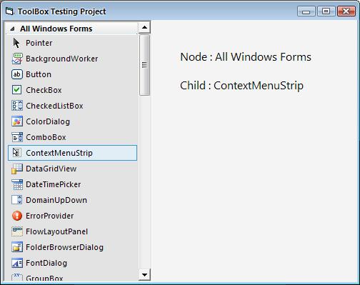



## ToolBox with Visual Studio 2005 Style \(Updated 12 Jan 08\)

### Description

Visual Studio 2005 Style ToolBox
 
### More Info
 

             |
---                |---
**Submitted On**   |2008-01-12 07:04:00
**By**             |[Fauzie](https://github.com/Planet-Source-Code/PSCIndex/blob/master/ByAuthor/fauzie.md)
**Level**          |Intermediate
**User Rating**    |4.8 (48 globes from 10 users)
**Compatibility**  |VB 6\.0
**Category**       |[Custom Controls/ Forms/  Menus](https://github.com/Planet-Source-Code/PSCIndex/blob/master/ByCategory/custom-controls-forms-menus__1-4.md)
**World**          |[Visual Basic](https://github.com/Planet-Source-Code/PSCIndex/blob/master/ByWorld/visual-basic.md)
**Archive File**   |[ToolBox\_wi2097731162008\.zip](https://github.com/Planet-Source-Code/fauzie-toolbox-with-visual-studio-2005-style-updated-12-jan-08__1-69841/archive/master.zip)

